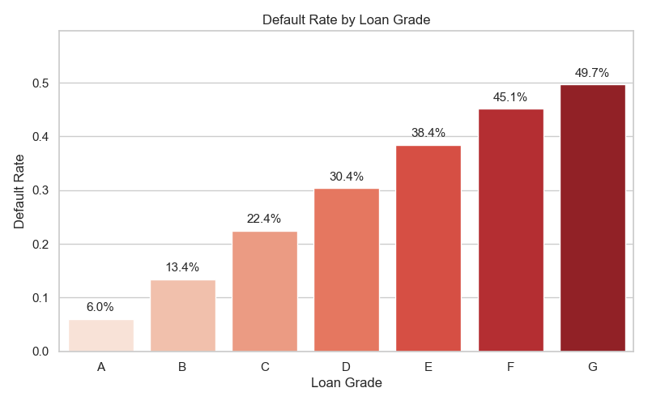
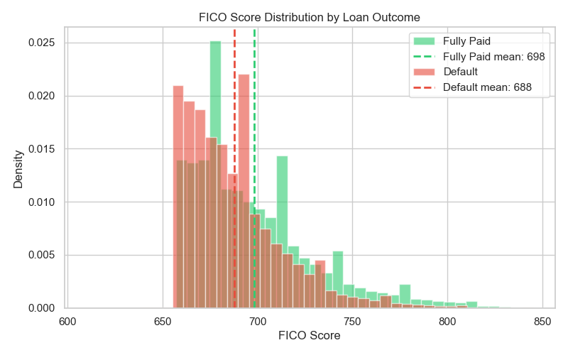
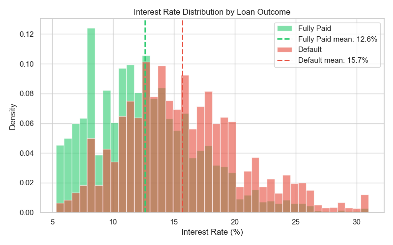
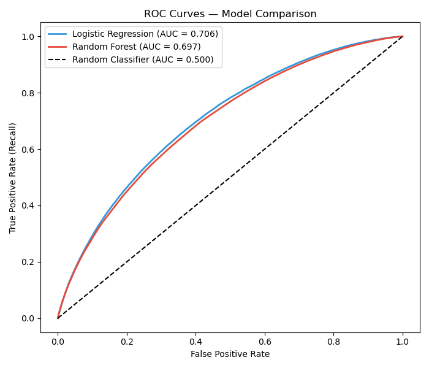
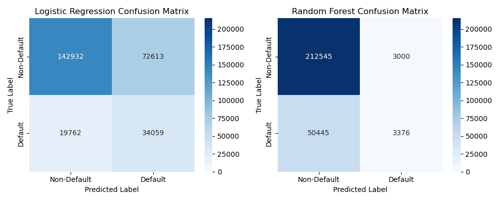
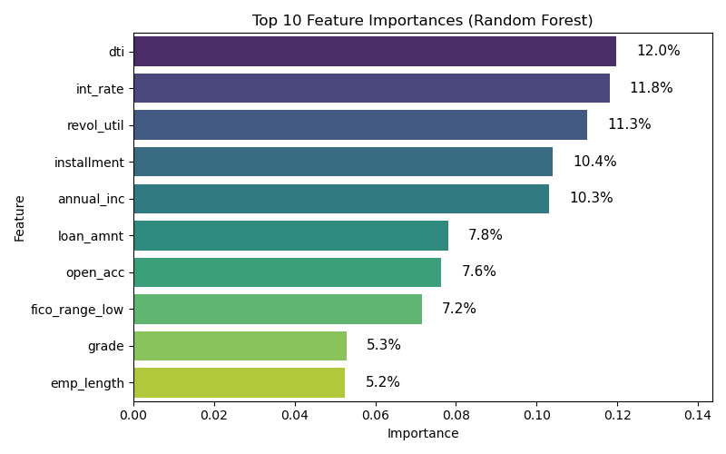

# Credit Risk Default Prediction
### Predicting loan default risk using machine learning on 1.3M real loans


---

## Overview
This project builds a machine learning pipeline to predict the probability 
that a loan applicant will default. Using 1.3 million real loans from the 
Lending Club dataset (2007–2018), two classification models are trained and 
compared. The final model achieves a ROC-AUC of 0.706 and catches 63% of 
genuine defaulters — prioritising recall given the asymmetric cost of missed 
defaults in credit risk.

## Dataset

The [Lending Club Loan Dataset](https://www.kaggle.com/datasets/wordsforthewise/lending-club) 
contains all accepted loan applications from 2007–2018. After filtering to 
completed loans with known outcomes and cleaning, the working dataset contains 
**1,346,829 loans** with a **20% default rate**.

| Feature | Description |
|---|---|
| `loan_amnt` | Requested loan amount |
| `term` | Loan duration (36 or 60 months) |
| `int_rate` | Annual interest rate (%) |
| `installment` | Fixed monthly repayment amount |
| `grade` | Lending Club internal risk grade (A–G) |
| `emp_length` | Years of employment (0–10) |
| `home_ownership` | RENT / MORTGAGE / OWN / OTHER |
| `annual_inc` | Self-reported annual income |
| `purpose` | Reason for loan application |
| `dti` | Debt-to-income ratio |
| `fico_range_low` | FICO credit score at application |
| `delinq_2yrs` | Late payments in past 2 years |
| `open_acc` | Number of open credit lines |
| `pub_rec` | Negative public records (bankruptcies etc.) |
| `revol_util` | Revolving credit utilisation (%) |

## Key EDA Findings

- **Loan grade** is the strongest visual predictor of default — 
  default rate rises from 6% (grade A) to 50% (grade G)
- **Interest rate** shows clear separation between defaulters 
  (mean 15.7%) and fully paid loans (mean 12.6%)
- **FICO score** differences are smaller than expected — only a 
  10 point mean difference, with heavy overlap between groups
- **DTI ratio** shows modest separation (17.8 vs 20.2 mean) 
  but distributions overlap heavily
- **Loan purpose** matters — small business loans default at 
  nearly 30%, almost double the overall rate of 20%
- **Delinquencies (2yr)** show weak positive signal but noisy 
  at higher values due to small sample sizes — feature retained 
  for modelling

### Default Rate by Loan Grade


### FICO Score Distribution


### Interest Rate Distribution


## Modelling

### Approach
Two models were trained on an 80/20 stratified train/test split:

**Logistic Regression** — interpretable baseline. Features scaled using 
StandardScaler fitted on training data only to prevent data leakage. 
`class_weight='balanced'` used to compensate for class imbalance.

**Random Forest** — ensemble of 100 decision trees. Does not require 
feature scaling. `class_weight='balanced'` applied at tree level.

### Results

| Model | ROC-AUC | Recall (Default) | Precision (Default) | Accuracy |
|---|---|---|---|---|
| **Logistic Regression** | **0.706** | **63%** | 32% | 66% |
| Random Forest | 0.697 | 6% | 53% | 80% |

### ROC Curves


### Confusion Matrices


### Feature Importance (Random Forest)


## Model Recommendation

I would recommend implementing the Logistic Regression model rather than the Random Forest model, despite their similar ROC–AUC scores (0.706 and 0.697 respectively), because of the substantial difference in recall between the two models. The Logistic Regression model achieves a recall of 63%, compared with only 6% for the Random Forest model.

In this context, recall represents the model’s ability to correctly identify borrowers who will default. Prioritising recall is critical in lending decisions because failing to detect a defaulter can result in the loss of the loan principal, expected interest, and additional debt recovery costs. In contrast, incorrectly flagging a creditworthy borrower as high-risk is generally less damaging. Such applicants can be reassessed through manual review, appeal the decision, or seek credit from alternative lenders, whereas a loan issued to a borrower who subsequently defaults cannot easily be reversed.

This higher recall, however, comes at the expense of precision. The Logistic Regression model has a precision of 32%, meaning that many loans flagged as potential defaults are in fact false positives. In practice, this trade-off can be managed operationally by routing flagged applications to manual credit assessment rather than automatically rejecting them. This approach allows lenders to capture a larger proportion of genuine defaulters while limiting the negative impact on legitimate borrowers.

Overall, the Logistic Regression model provides a more risk-averse and practically useful screening tool, as it substantially improves the detection of potential defaulters while maintaining a comparable overall discriminatory ability to the Random Forest model.

## Data Quality & Limitations

- **Negative DTI values:** 2 records contained negative DTI ratios, 
  likely data entry errors. Retained as impact on model training 
  is negligible (<0.001% of data)
- **emp_length missing values:** 5.8% of records had no employment 
  length recorded — imputed with median rather than mean due to 
  right-skewed distribution
- **Synthetic personal data:** Features capturing personal 
  circumstances (dependants, cost of living, job stability) are 
  absent from the dataset — limiting the model's ability to capture 
  the full picture of borrower risk
- **Temporal independence:** Loans from the same region and time 
  period are not truly independent — a local economic shock affects 
  many borrowers simultaneously
- **Historical bias:** If past lending decisions reflected 
  discriminatory practices, the model may learn and perpetuate 
  those patterns

## How to Run
```bash
# Clone the repository
git clone https://github.com/franciscopalumbo/credit-risk-default.git
cd credit-risk-default

# Install dependencies
pip install pandas numpy scikit-learn matplotlib seaborn

# Download dataset from Kaggle and place in data/ folder
# https://www.kaggle.com/datasets/wordsforthewise/lending-club

# Run scripts in order
python explore.py    # Load, clean and save dataset
python eda.py        # Generate exploratory visualisations  
python model.py      # Train models and evaluate results
```

## Project Structure
```
credit-risk-default/
├── data/                  # Dataset (not tracked — see .gitignore)
├── images/                # Charts displayed in this README
├── outputs/               # Generated figures (not tracked)
├── explore.py             # Data loading, cleaning, feature selection
├── eda.py                 # Exploratory data analysis
├── model.py               # Model training and evaluation
└── README.md
```

## Status
- [x] Repo created
- [x] Data acquired
- [x] Exploratory analysis
- [x] Model built
- [x] Results & write-up

## Project Plan

### Business Problem
Lenders lose significant money when borrowers default on loans — losing the principal, 
interest, and debt recovery costs. This project builds a model to help lenders assess 
the likelihood of default at the point of application, supporting better decisions on 
whether to approve a loan and on what terms.

### What Does Success Look Like?
Missing a genuine defaulter (false negative) is more costly than wrongly flagging a 
good borrower (false positive). A rejected good borrower can appeal or apply elsewhere 
— a defaulted loan cannot be undone. Our model will therefore prioritise catching 
defaulters, and we will evaluate it using metrics that reflect this, not just accuracy.

### Plan of Attack
1. Load and inspect the data
2. Clean the data (handle missing values, fix data types)
3. Explore the data — visualisations, patterns, relationships
4. Prepare features for modelling (encode categories, scale numbers)
5. Train two models — Logistic Regression and Random Forest
6. Evaluate and compare the models
7. Write up findings in the README

## Author

**Francisco Palumbo**  
3rd Year Data Science, University of Melbourne  
[LinkedIn](https://www.linkedin.com/in/franciscopalumbo) · 
[GitHub](https://github.com/franciscopalumbo)  
francisco.palumbo@outlook.com